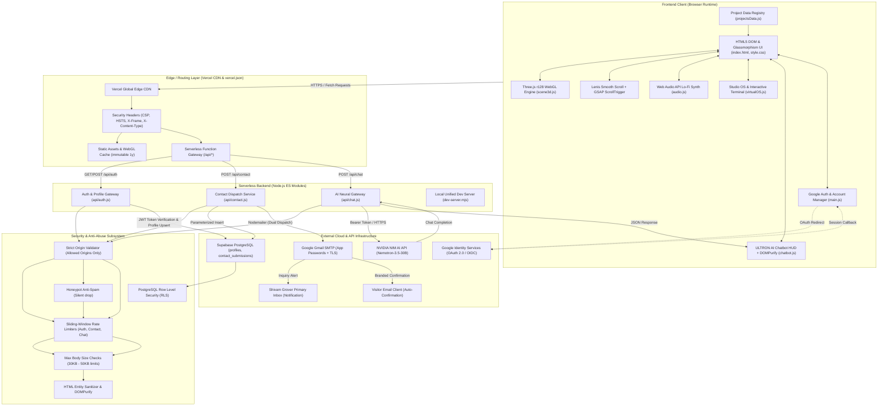
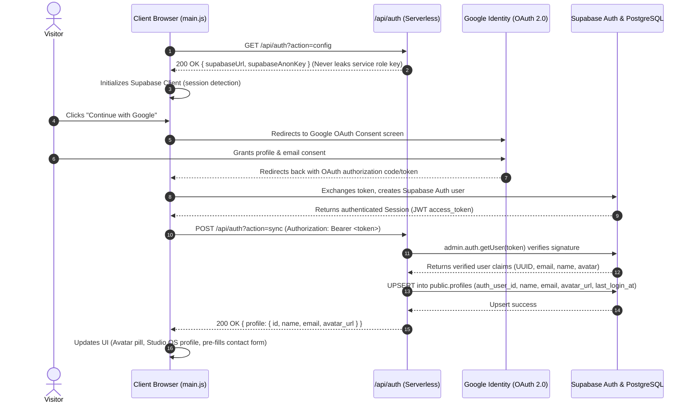
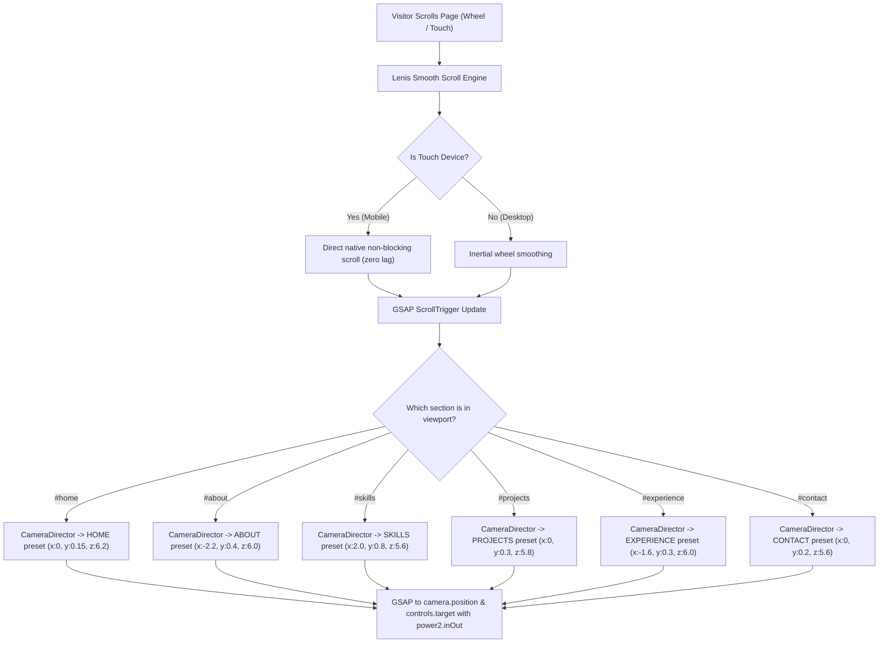
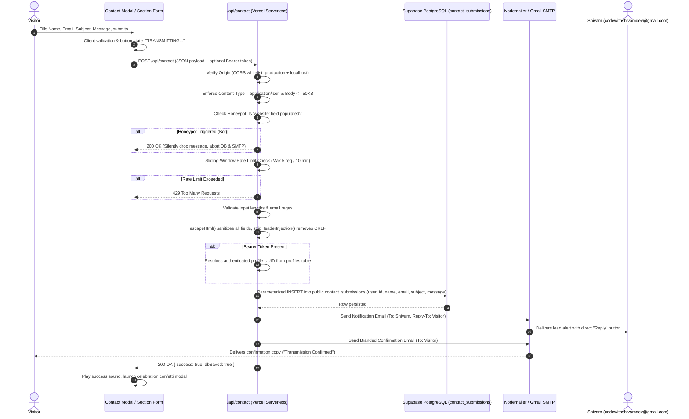
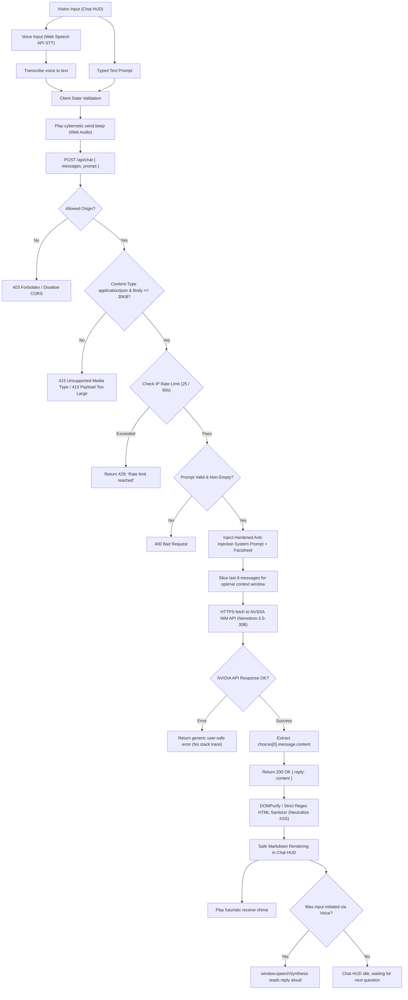
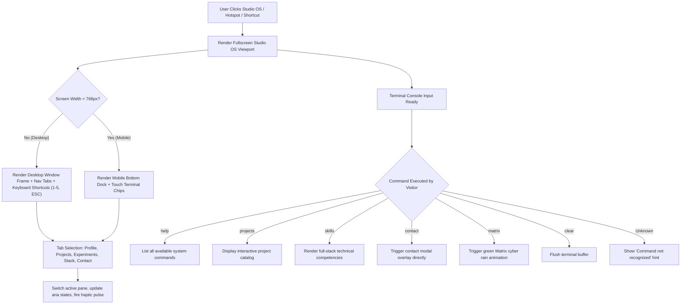

# Shivam Grover 3D Portfolio — System Architecture & Flowcharts

This document provides an exhaustive technical blueprint, system flowcharts, stack specifications, and security audit for the **Shivam Grover 3D Interactive Portfolio & Studio OS**.

---

## Table of Contents
1. [Master System Architecture](#1-master-system-architecture)
2. [Google OAuth & Supabase Authentication Pipeline](#2-google-oauth--supabase-authentication-pipeline)
3. [Application Initialization & 3D Boot Pipeline](#3-application-initialization--3d-boot-pipeline)
4. [Camera Choreography & Scroll Synchronization](#4-camera-choreography--scroll-synchronization)
5. [Contact Form Security, PostgreSQL Persistence & Dual-Email Dispatch](#5-contact-form-security-postgresql-persistence--dual-email-dispatch)
6. [ULTRON AI Conversational Engine](#6-ultron-ai-conversational-engine)
7. [Algorithmic Web Audio Synthesizer](#7-algorithmic-web-audio-synthesizer)
8. [Virtual Studio OS & Terminal Pipeline](#8-virtual-studio-os--terminal-pipeline)
9. [Frontend Technology Stack](#9-frontend-technology-stack)
10. [Backend Technology Stack](#10-backend-technology-stack)
11. [Comprehensive Security Audit](#11-comprehensive-security-audit)
12. [Project File Map](#12-project-file-map)

---

## 1. Master System Architecture



---

## 2. Google OAuth & Supabase Authentication Pipeline



---

## 3. Application Initialization & 3D Boot Pipeline

```mermaid
sequenceDiagram
    autonumber
    actor Visitor as Visitor
    participant Window as Browser Window
    participant Main as main.js Orchestrator
    participant Scene as scene3d.js (Three.js)
    participant Audio as audio.js (Web Audio)
    participant UI as DOM & Loading Screen

    Visitor->>Window: Navigates to Portfolio URL
    Window->>Main: DOMContentLoaded event fired
    Main->>UI: Show Loading Screen ("INITIALIZING 3D CORE...")
    Main->>Scene: Init StudioScene instance
    
    Scene->>Scene: Device Profiler runs (CPU cores, RAM, GPU renderer string)
    alt High-End GPU / Desktop
        Scene->>Scene: Set Tier = "HIGH", DPR capped at 2.0, full particle count
    alt Mid-Range Mobile (e.g. Snapdragon 680)
        Scene->>Scene: Set Tier = "MEDIUM" or "LOW", DPR capped at 1.25
    alt WebGL unsupported or context crashes
        Scene->>UI: Show Fallback 2D Banner, switch to 2D Mode
    end

    Scene->>Scene: Build Procedural Holographic Sphere & Lights
    Scene->>Scene: Start requestAnimationFrame Render Loop
    Scene-->>Main: Scene ready callback
    Main->>UI: Fade out loading overlay, enable user interaction
    
    Visitor->>Window: First user gesture (Click / Scroll)
    Window->>Audio: Resume AudioContext (Unlock browser autoplay policy)
    Audio->>Audio: Start Ambient Lo-Fi chord progression (30% volume)
```

---

## 4. Camera Choreography & Scroll Synchronization



---

## 5. Contact Form Security, PostgreSQL Persistence & Dual-Email Dispatch



---

## 6. ULTRON AI Conversational Engine



---

## 7. Algorithmic Web Audio Synthesizer

```mermaid
flowchart LR
    Catalog["8-Track Chord Catalog (Rhodes, Ambient Pad, Minimalist Synth)"] --> TrackSelect["Fisher-Yates Playlist Shuffler"]
    TrackSelect --> StartClock["Audio Clock Scheduler (audioCtx.currentTime)"]
    
    StartClock --> ChordLoop["Chord Progression Step (Every 4.0 seconds)"]
    ChordLoop --> OscNodes["Instantiate 4-5 OscillatorNodes (Sine / Triangle)"]
    OscNodes --> Biquad["BiquadFilterNode (Lowpass filter, cut off harsh frequencies)"]
    Biquad --> GainEnvelope["GainNode (Attack: 0.8s, Decay: 1.2s, Sustain, Release: 1.8s)"]
    GainEnvelope --> MasterGain["Master Gain Node (User-calibrated ~30% volume)"]
    MasterGain --> Analyser["AnalyserNode (FFT frequency data for HUD visualizers)"]
    Analyser --> Speakers["audioCtx.destination (Speaker / Headphones)"]
```



---

## 8. Virtual Studio OS & Terminal Pipeline



---

## 9. Frontend Technology Stack

| Layer / Technology | Specification & Role | Implementation Files |
| :--- | :--- | :--- |
| **Markup & Semantics** | Semantic HTML5, Schema.org JSON-LD structured data (`Person`, `WebSite`, `ProfilePage`), OpenGraph meta tags, Twitter Card tags, AI discoverability via `llms.txt`. | `index.html`, `llms.txt` |
| **Styling & Design System** | Vanilla CSS3 (116 KB) with zero framework bloat. Cyberpunk/glassmorphism theme, HSL/RGB design tokens, CSS Grid/Flexbox, `backdrop-filter`, hardware-accelerated animations, safe-area insets (`env(safe-area-inset-*)`). | `style.css` |
| **Authentication & Database Client** | **Supabase Auth JS SDK (v2)**. Google OAuth 2.0 / OpenID Connect session management, token persistence, and backend synchronization. | Loaded via CDN in `index.html`, managed in `main.js` |
| **XSS Sanitizer** | **DOMPurify v3.0.9**. Neutralizes malicious HTML, event handlers, scripts, and injection vectors in AI chatbot responses. | Loaded via CDN in `index.html`, utilized in `chatbot.js` |
| **3D Graphics Engine** | **Three.js r128** + WebGL. Procedural particle sphere, holographic geometry meshes, real-time lighting, interactive camera choreography, and mouse raycasting. | `scene3d.js` |
| **Animation Choreography** | **GSAP 3.12.2** & **ScrollTrigger**. Synchronized camera transitions, 3D target coordinates, staggered reveal tweens, and smooth opacity transitions. | CDN loaded in `index.html` |
| **Smooth Scrolling** | **Lenis 1.1.18**. Desktop inertial smoothing with native touch pass-through on mobile to prevent scrolling lag. | CDN loaded in `index.html`, `main.js` |
| **Audio Synthesis** | Native **Web Audio API**. 8 algorithmic Lo-Fi soundscapes created using `OscillatorNode`, `BiquadFilterNode`, and `GainNode`. Procedural chord generation with 0 external audio files. | `audio.js` |
| **Virtual Operating System** | Custom desktop OS simulation (`Studio OS`) inside the browser with a multi-tab window manager (Profile, Projects, Experiments, Stack, Contact) and simulated command terminal. | `virtualOS.js` |
| **Conversational AI HUD** | **ULTRON Cybernetic AI Assistant**. Markdown parser, speech synthesis (TTS), Web Speech API speech-to-text, sound effects, and direct action triggers. | `chatbot.js` |
| **Iconography & Fonts** | Lucide Icons (CDN) + Google Fonts (*Outfit*, *Inter*, *JetBrains Mono*). | Loaded in `index.html` |

---

## 10. Backend Technology Stack

| Layer / Technology | Specification & Role | Implementation Files |
| :--- | :--- | :--- |
| **Database & Identity** | **Supabase PostgreSQL** + **Supabase Auth**. Relational storage with Row Level Security (RLS) for user profiles and inbound contact submissions. | `supabase/schema.sql`, `api/auth.js`, `api/contact.js` |
| **Serverless Architecture** | **Vercel Serverless Functions** (Node.js ES Modules). Independent on-demand execution, zero persistent server overhead, fast global distribution. | `api/auth.js`, `api/contact.js`, `api/chat.js` |
| **Local Dev Server** | Custom Node.js HTTP server mimicking Vercel's edge environment locally. Dynamically reads `.env.local`, handles multipart routing, JSON payload parsing, and MIME types. | `dev-server.mjs` |
| **Email Dispatch Engine** | **Nodemailer v10.0.9** + Google Gmail SMTP (SSL/TLS, App Password authentication, zero known CVEs). Dual-email routing with CRLF injection stripping. | `api/contact.js` |
| **AI LLM Provider** | **NVIDIA NIM API** (`nvidia/nemotron-3.5-lightning-30b-a3b`). REST chat completions with anti-prompt-injection system prompt and rolling message context. | `api/chat.js` |

---

## 11. Comprehensive Security Audit

### 🔒 Audited Security Score: **9.5 / 10** *(Hardened Production-Grade)*

### Defense-in-Depth Implementation Details:

1. **Content-Security-Policy (CSP) & HTTP Security Headers (`vercel.json`)**:
   * `Content-Security-Policy: default-src 'self'; script-src 'self' 'unsafe-inline' 'unsafe-eval' https://cdnjs.cloudflare.com https://cdn.jsdelivr.net https://unpkg.com https://accounts.google.com https://apis.google.com; style-src 'self' 'unsafe-inline' https://fonts.googleapis.com; font-src 'self' https://fonts.gstatic.com data:; img-src 'self' data: blob: https:; connect-src 'self' https://*.supabase.co wss://*.supabase.co https://accounts.google.com https://integrate.api.nvidia.com https://unpkg.com; frame-src 'self' https://accounts.google.com; frame-ancestors 'self'; object-src 'none'; base-uri 'self'; form-action 'self';`
   * `X-Content-Type-Options: nosniff` (Blocks MIME-type sniffing).
   * `X-Frame-Options: SAMEORIGIN` (Blocks framing & clickjacking).
   * `Strict-Transport-Security: max-age=63072000; includeSubDomains; preload` (Enforces HTTPS for 2 years).
   * `Referrer-Policy: strict-origin-when-cross-origin` (Protects URL path privacy).
   * `Permissions-Policy: camera=(), microphone=(self), geolocation=()` (Restricts sensor access).
   * *Deprecated `X-XSS-Protection` removed in favor of CSP*.

2. **Strict Origin-Based CORS Filtering**:
   * Removed wildcard `Access-Control-Allow-Origin: *`.
   * All API endpoints (`/api/auth`, `/api/contact`, `/api/chat`) explicitly validate request origin against:
     - `https://3-d-portfolio-mu-seven.vercel.app`
     - `http://localhost:3000` / `http://127.0.0.1:3000`
   * Unauthorized cross-origin requests do not receive CORS authorization.

3. **Honeypot Anti-Spam Trap & DoS Rate Limiting**:
   * Form includes an invisible input field `website`.
   * Automated bots populate this field. Submissions with data in this field are caught and returned a dummy `200 OK` without sending emails or persisting spam.
   * In-memory sliding-window limiters:
     - `/api/auth`: Max 30 requests / 60 seconds / IP.
     - `/api/contact`: Max 5 submissions / 10 minutes / IP.
     - `/api/chat`: Max 25 inquiries / 60 seconds / IP.

4. **XSS & HTML Injection Mitigation**:
   * Client-side ULTRON chatbot responses are purified using **DOMPurify** with strict whitelist constraints, complemented by a regex fallback sanitizer.
   * Contact form inputs are converted into HTML entities via `escapeHtml()` prior to email template rendering.
   * `stripHeaderInjection()` sanitizes CRLF (`\r`, `\n`) characters to neutralize SMTP header splitting.

5. **PostgreSQL Database Security & Row Level Security (RLS)**:
   * Parameterized queries via Supabase JS SDK (eliminates SQL injection).
   * `public.profiles`: Row Level Security enabled. Users can only select and update their own records (`auth.uid() = auth_user_id`).
   * `public.contact_submissions`: Row Level Security enabled. Only the submission author or service role can query entries.
   * Service role key (`SUPABASE_SERVICE_ROLE_KEY`) is strictly confined to server-side serverless functions and never exposed to the client.

6. **Directory Traversal Protection**:
   * In `dev-server.mjs`, all file paths are validated against `__dirname`, returning `403 Forbidden` for any traversal attempt.

---

## 12. Project File Map

```
3D portfolio/
├── .env.example                     # Environment variable template with Supabase & SMTP
├── .env.local                       # Local dev secrets (git-ignored)
├── .gitignore                       # Git ignore file (excluding secrets, build caches)
├── LICENSE                          # MIT License
├── README.md                        # Portfolio documentation
├── FLOWCHARTS.md                    # This architecture, flowchart & security specification
├── api/
│   ├── auth.js                      # Serverless Auth config & profile synchronization
│   ├── chat.js                      # Serverless ULTRON AI Chatbot endpoint (NVIDIA NIM)
│   └── contact.js                   # Serverless contact form endpoint (PostgreSQL + SMTP)
├── assets/
│   ├── apple-touch-icon.png         # iOS home screen icon
│   ├── favicon-16x16.png            # Browser tab icon (16x16)
│   ├── favicon-32x32.png            # Browser tab icon (32x32)
│   ├── favicon.svg                  # Vector favicon
│   ├── og-image.jpg                 # OpenGraph & Twitter preview image
│   ├── ultron-avatar.jpg            # Cybernetic AI assistant avatar
│   ├── computer/
│   │   └── shivam-os-wallpaper.jpg  # Virtual Studio OS desktop wallpaper
│   └── covers/                      # Showcase project cover thumbnails
│       ├── aevonix.jpg
│       ├── aiautomation.jpg
│       ├── collegespathshala.jpg
│       ├── sagaholidays.jpg
│       └── vacationvisits.jpg
├── audio.js                         # Web Audio API 8-track algorithmic synthesizer
├── chatbot.js                       # ULTRON AI Cybernetic HUD with DOMPurify XSS mitigation
├── dev-server.mjs                   # Local development server with Vercel API emulation
├── favicon.ico                      # Root legacy favicon
├── google183f0a76e37c8536.html       # Google Search Console domain verification
├── index.html                       # Semantic HTML5 entry point & Google Auth UI
├── llms.txt                         # AI search engine & LLM crawler documentation
├── main.js                          # Main orchestrator, Google Auth & Supabase sync
├── package.json                     # Node.js project manifest
├── package-lock.json                # Locked dependency tree (Nodemailer 10.x, Supabase 2.x)
├── projectsData.js                  # Modular showcase project registry
├── robots.txt                       # Search engine crawler directives (/api/ disallowed)
├── scene3d.js                       # Three.js r128 procedural 3D graphics & camera director
├── sitemap.xml                      # XML search engine sitemap
├── style.css                        # Design system & responsive glassmorphic stylesheet
├── supabase/
│   └── schema.sql                   # Supabase PostgreSQL schema with RLS policies
├── vercel.json                      # Vercel edge deployment config, CSP & security headers
└── virtualOS.js                     # Interactive Studio OS desktop & command terminal
```
