# Shivam Grover 3D Portfolio — Complete System Architecture & Technical Flowcharts

This document serves as the comprehensive engineering blueprint, architectural flowcharts, function-by-function logic manual, API data-fetching specification, and security audit for the **Shivam Grover 3D Interactive Portfolio & Studio OS** ([3-d-portfolio-mu-seven.vercel.app](https://3-d-portfolio-mu-seven.vercel.app)).

---

## Table of Contents
1. [Master System Architecture](#1-master-system-architecture)
2. [End-to-End User Journey & Page Lifecycle](#2-end-to-end-user-journey--page-lifecycle)
3. [Application Boot, WebGL Shader Engine & 3D Scene Initialization](#3-application-boot-webgl-shader-engine--3d-scene-initialization)
4. [Google OAuth 2.0 & Resilient Supabase Identity Pipeline](#4-google-oauth-20--resilient-supabase-identity-pipeline)
5. [Mobile Navigation & Hamburger Drawer Engine](#5-mobile-navigation--hamburger-drawer-engine)
6. [Circular Animated Music Player & Expandable Capsule Pipeline](#6-circular-animated-music-player--expandable-capsule-pipeline)
7. [Camera Choreography & Lenis Scroll Synchronization](#7-camera-choreography--lenis-scroll-synchronization)
8. [Digital Projects Exhibition Engine](#8-digital-projects-exhibition-engine)
9. [Contact Form Security, PostgreSQL Persistence & Dual-Email Dispatch](#9-contact-form-security-postgresql-persistence--dual-email-dispatch)
10. [ULTRON AI Conversational Engine & Fast Neural Inference Pipeline](#10-ultron-ai-conversational-engine--fast-neural-inference-pipeline)
11. [Algorithmic Web Audio Synthesizer](#11-algorithmic-web-audio-synthesizer)
12. [Virtual Studio OS & Interactive Terminal Subsystem](#12-virtual-studio-os--interactive-terminal-subsystem)
13. [Comprehensive Function-by-Function & Logic Reference](#13-comprehensive-function-by-function--logic-reference)
    - [13.1 Frontend: `main.js`](#131-frontend-mainjs)
    - [13.2 Frontend: `scene3d.js`](#132-frontend-scene3djs)
    - [13.3 Frontend: `audio.js`](#133-frontend-audiojs)
    - [13.4 Frontend: `chatbot.js`](#134-frontend-chatbotjs)
    - [13.5 Frontend: `virtualOS.js`](#135-frontend-virtualosjs)
    - [13.6 Backend: `api/auth.js`](#136-backend-apiauthjs)
    - [13.7 Backend: `api/contact.js`](#137-backend-apicontactjs)
    - [13.8 Backend: `api/chat.js`](#138-backend-apichatjs)
    - [13.9 Server: `dev-server.mjs`](#139-server-dev-servermjs)
14. [How APIs Fetch, Validate & Exchange Data](#14-how-apis-fetch-validate--exchange-data)
15. [Frontend & Backend Technology Stack Specifications](#15-frontend--backend-technology-stack-specifications)
16. [Comprehensive Security Audit & Defense-in-Depth Matrix](#16-comprehensive-security-audit--defense-in-depth-matrix)
17. [Project File Map](#17-project-file-map)

---

## 1. Master System Architecture

The application is structured into four decoupled, high-performance tiers: **Browser Client Runtime**, **Edge Routing & Security**, **Serverless Compute**, and **External Cloud Services**.

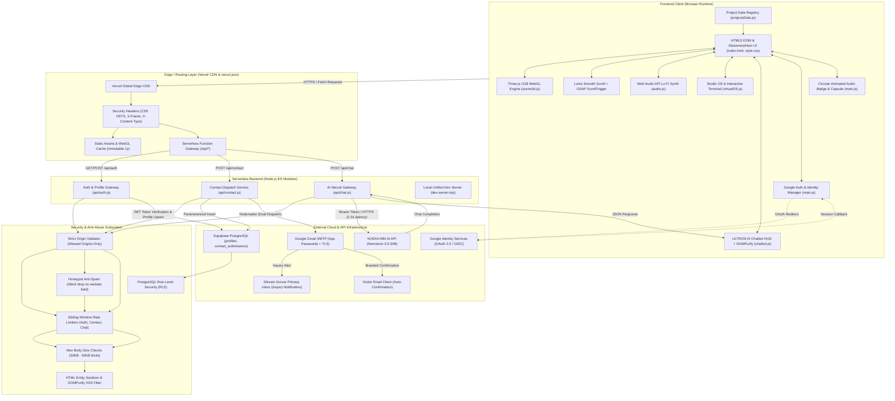

---

## 2. End-to-End User Journey & Page Lifecycle

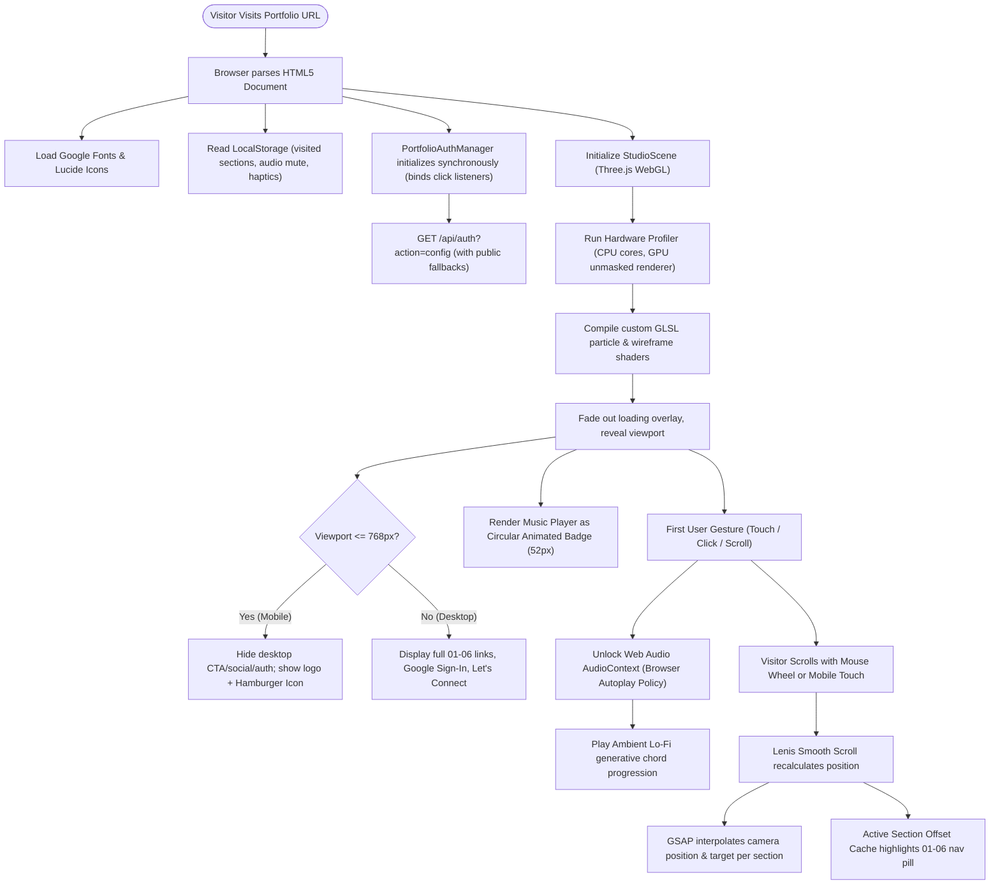

---

## 3. Application Boot, WebGL Shader Engine & 3D Scene Initialization

The 3D background is rendered using a custom procedural WebGL pipeline in `scene3d.js`.

```mermaid
sequenceDiagram
    autonumber
    actor Visitor as Visitor
    participant Browser as Browser Window
    participant Main as main.js Orchestrator
    participant Scene as scene3d.js (StudioScene)
    participant Three as Three.js WebGLRenderer
    participant UI as DOM & Loading Bar

    Visitor->>Browser: Opens Portfolio
    Browser->>Main: DOMContentLoaded event
    Main->>UI: Show Loading Screen ("INITIALIZING 3D CORE...")
    Main->>Scene: new StudioScene(container)
    
    Scene->>Scene: profileDevice() (Checks cores, navigator.deviceMemory, GPU string)
    alt High-Performance Desktop (Discrete GPU)
        Scene->>Scene: Tier = 'HIGH', DPR capped at 2.0, max particles: 1,800
    alt Mid-Range Mobile (e.g. Snapdragon, Helio)
        Scene->>Scene: Tier = 'MEDIUM', DPR capped at 1.25, max particles: 900
    alt Low-Power / Fallback
        Scene->>Scene: Tier = 'LOW', DPR capped at 1.0, max particles: 450
    end

    Scene->>Three: new THREE.WebGLRenderer({ antialias, alpha, powerPreference: 'high-performance' })
    Scene->>Scene: createScene(), createLights(), createHolographicSphere()
    Scene->>Scene: Compile BufferGeometry particle arrays with custom cyan/purple glow
    Scene->>Three: Instantiate PerspectiveCamera(fov: 45, near: 0.1, far: 1000)
    Scene->>Scene: setupControls() (OrbitControls with strict azimuth & polar limits)
    Scene->>Scene: animate() requestAnimationFrame render loop starts
    
    Scene-->>Main: onReady callback fired
    Main->>UI: Animate #loading-bar-fill to 100%, fade out loader overlay
    Main->>Main: Enable interactive pointer events on content layer
```

---

## 4. Google OAuth 2.0 & Resilient Supabase Identity Pipeline

This pipeline guarantees **zero silent click failures** by attaching event listeners synchronously and using robust client-side and server-side fallbacks.

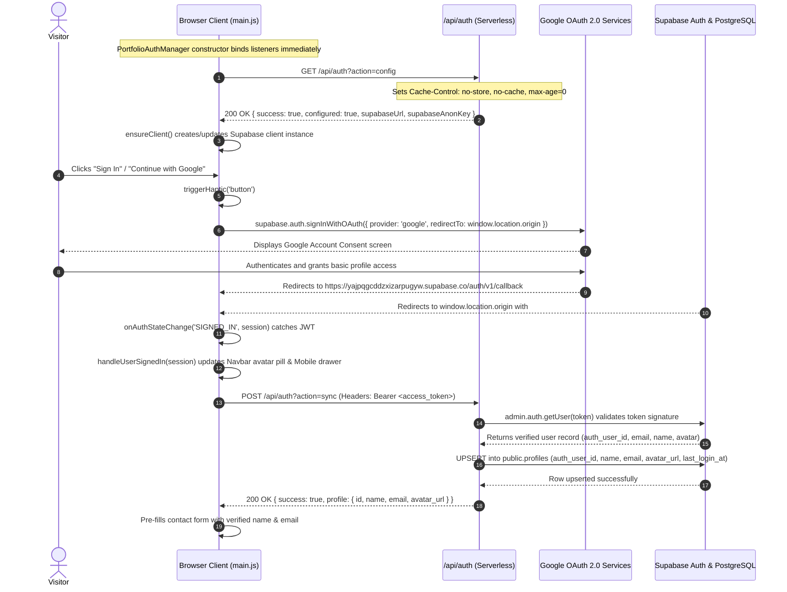

---

## 5. Mobile Navigation & Hamburger Drawer Engine

On mobile viewports (`max-width: 768px`), all secondary controls are consolidated into the mobile slide-out drawer to provide an uncluttered user experience.

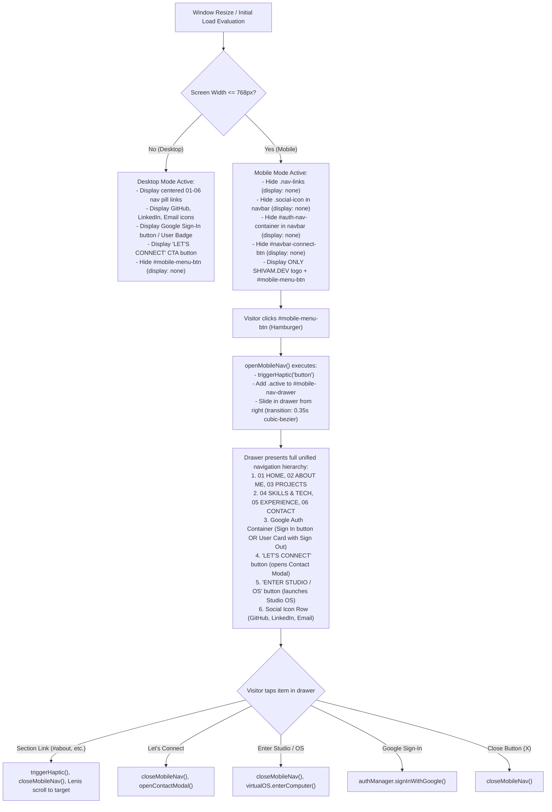

---

## 6. Circular Animated Music Player & Expandable Capsule Pipeline

The music player operates in two distinct states: an animated circular floating badge (default) and an expanded horizontal glass capsule.

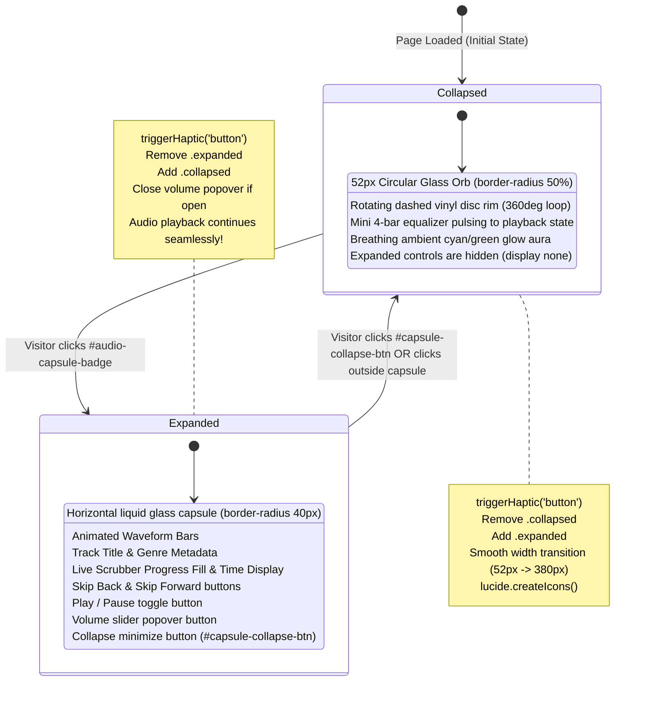

---

## 7. Camera Choreography & Lenis Scroll Synchronization

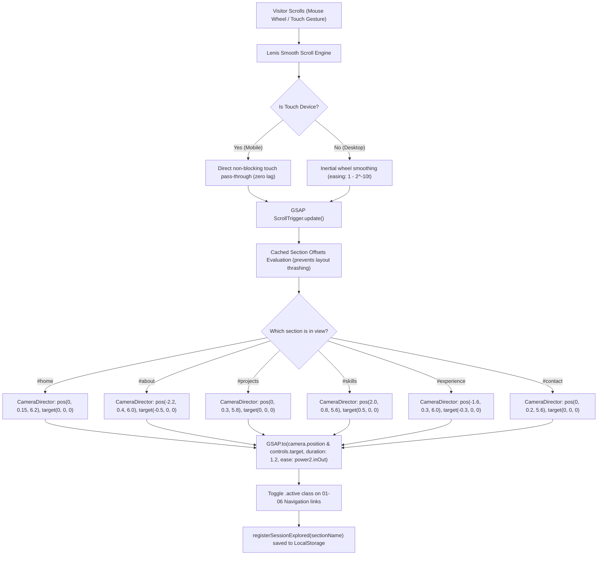

---

## 8. Digital Projects Exhibition Engine

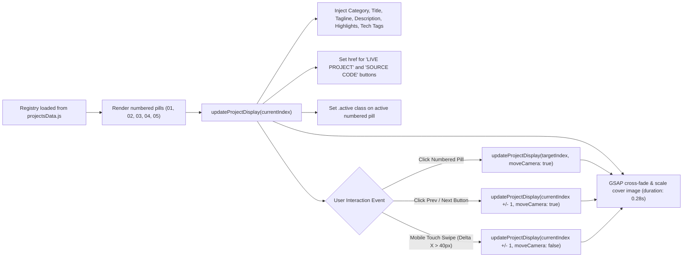

---

## 9. Contact Form Security, PostgreSQL Persistence & Dual-Email Dispatch

```mermaid
sequenceDiagram
    autonumber
    actor User as Visitor
    participant Form as Contact Modal / Inline Form (main.js)
    participant API as /api/contact (Serverless Node.js)
    participant DB as Supabase PostgreSQL (contact_submissions)
    participant SMTP as Google Gmail SMTP (Nodemailer)
    actor Owner as Shivam Grover (codewithshivamdev@gmail.com)

    User->>Form: Enters Name, Email, Subject, Message and clicks "TRANSMIT MESSAGE"
    Form->>Form: Client validation: Name >= 2, Email regex, Message >= 5
    Form->>Form: Button set to "TRANSMITTING...", triggerHaptic('action')

    Form->>API: POST /api/contact (JSON body + optional Authorization: Bearer <token>)
    API->>API: setCorsAndSecurityHeaders() (Strict origin validation)
    API->>API: Enforce Content-Type = application/json & Body <= 50KB
    API->>API: isContactRateLimited(ip) (Max 5 transmissions / 10 min)
    alt Rate Limit Exceeded
        API-->>Form: 429 Too Many Requests
    end

    API->>API: Check Honeypot: Is 'website' field non-empty?
    alt Honeypot Triggered (Bot)
        API-->>Form: 200 OK { success: true } (Silently drop submission)
    end

    API->>API: escapeHtml() sanitizes all fields; stripHeaderInjection() removes CRLF

    alt Bearer JWT Provided
        API->>DB: Resolves user profile ID from public.profiles
    end

    API->>DB: Parameterized INSERT into public.contact_submissions (name, email, subject, message)
    DB-->>API: Row stored

    API->>SMTP: sendMail() Lead Alert to Shivam (Reply-To set to Visitor's email)
    SMTP-->>Owner: Delivers notification with message details & quick reply button

    API->>SMTP: sendMail() Branded Confirmation to Visitor
    SMTP-->>User: Delivers confirmation email with portfolio signature

    API-->>Form: 200 OK { success: true, message: 'Message transmitted successfully' }
    Form->>Form: Reset form fields, close contact modal
    Form->>Form: openCelebrationModal() launches Confetti Animation & success message
```

---

## 10. ULTRON AI Conversational Engine & Fast Neural Inference Pipeline

Tuned to deliver **2.3-second rapid inference** with strict security and cyberpunk aesthetics.

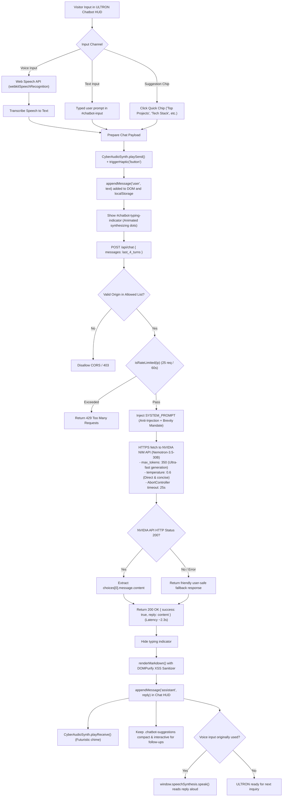

---

## 11. Algorithmic Web Audio Synthesizer

The music system in `audio.js` generates all soundscapes algorithmically using the Web Audio API with **zero external MP3 files**.

```mermaid
flowchart LR
    TrackCatalog["8-Track Chord Catalog (Rhodes, Cyber Lounge, Minimal Ambient)"] --> Shuffler["Fisher-Yates Playlist Shuffler"]
    Shuffler --> AudioContext["Native AudioContext (Unlocked on first user gesture)"]
    
    AudioContext --> ChordClock["Procedural Clock Scheduler (every 4.0s)"]
    ChordClock --> ChordNotes["Compute frequencies for 4-note chord (Hz)"]
    
    ChordNotes --> PolyOsc["4 x OscillatorNode (Sine / Triangle)"]
    PolyOsc --> Filter["BiquadFilterNode (Lowpass filter @ 800Hz-1200Hz)"]
    Filter --> Envelope["GainNode ADSR Envelope (Attack: 0.8s, Release: 1.8s)"]
    Envelope --> MasterGain["Master GainNode (~30% volume)"]
    MasterGain --> VisualizerAnalyser["AnalyserNode (FFT frequency spectrum analysis)"]
    VisualizerAnalyser --> Destination["audioCtx.destination (Speakers / Headphones)"]
    
    VisualizerAnalyser -. "Frequency Data" .-> SyncCapsule["Syncs with #capsule-waveform and circular badge"]
```

---

## 12. Virtual Studio OS & Interactive Terminal Subsystem

`virtualOS.js` delivers an interactive operating system experience inside the portfolio.

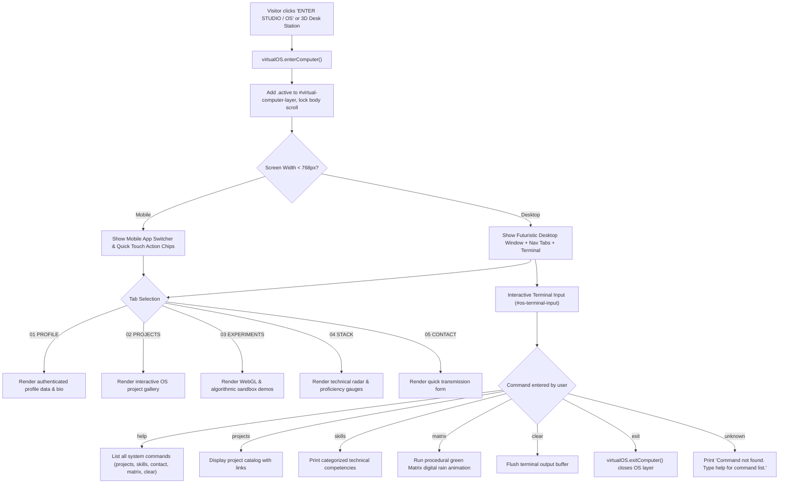

---

## 13. Comprehensive Function-by-Function & Logic Reference

### 13.1 Frontend: `main.js`

| Function / Method | Parameters | Return Type | Logic & Technical Description |
| :--- | :--- | :--- | :--- |
| `triggerHaptic(type)` | `type: string` ('button', 'project', 'action', 'reset') | `void` | Checks `localStorage.portfolio_haptics_enabled`. If enabled and `navigator.vibrate` is supported, executes tailored vibration sequences (e.g. 10ms for clicks, [15, 10, 15]ms for actions). Safely caught on iOS. |
| `registerSessionExplored(title)` | `title: string` | `void` | Manages an array of visited section titles in `localStorage.portfolio_visited_sections`. Dispatches `session_progress_updated` custom event for UI tracking. |
| `updateProjectDisplay(index, moveCamera)` | `index: number, moveCamera: boolean` | `void` | Centralized project carousel controller. Updates index counter, switches `.active` numbered pills, triggers GSAP cross-fade on cover image, populates description, tech stack tags, and dynamically toggles live/github links. Optionally commands `studioScene.focusOnProjectObject()`. |
| `selectProjectById(id)` | `id: string` | `void` | Finds project in `PROJECTS_DATA` matching ID and calls `updateProjectDisplay()`. |
| `cacheSectionOffsets()` | `none` | `void` | Pre-computes and caches `offsetTop` and `offsetHeight` for all sections (`#home`, `#about`, etc.) to prevent layout thrashing during scroll events. Recalculated on window resize. |
| `updateActiveNav()` | `none` | `void` | Compares current Lenis/window scroll position against cached section offsets, toggles `.active` on navigation links, and logs exploration progress. |
| `openMobileNav()` | `none` | `void` | Triggers haptic pulse and adds `.active` to `#mobile-nav-drawer`, sliding in the mobile menu. |
| `closeMobileNav()` | `none` | `void` | Triggers haptic pulse and removes `.active` from `#mobile-nav-drawer`. |
| `attachTouchSafeClick(element, callback)` | `element: HTMLElement, callback: Function` | `void` | Discriminates between intentional taps and scroll swipes by measuring touch movement delta (`dx > 8` or `dy > 8`). Prevents click event firing when the user was actually scrolling. |
| `formatTime(seconds)` | `seconds: number` | `string` | Formats raw seconds into `MM:SS` string display. |
| `updateProgressFrame()` | `none` | `void` | `requestAnimationFrame` loop updating `#capsule-progress-fill` width and `#capsule-current-time` display based on `window.lofiAudio.currentTime`. |
| `startProgressLoop()` / `stopProgressLoop()` | `none` | `void` | Starts and halts the timeline animation frame loop. |
| `syncCapsuleMeta(track)` | `track: Object` | `void` | Updates track title, genre tag, and duration in the audio capsule player. |
| `updatePlaybackUI(isPlaying)` | `isPlaying: boolean` | `void` | Toggles `.playing` and `.paused` classes on `#audio-capsule`, switches play/pause icons, and starts/stops progress ticker. |
| `togglePlayback()` | `none` | `void` | Triggers haptic feedback and invokes `window.lofiAudio.toggle()`. |
| `expandCapsule(e)` | `e: Event` | `void` | Expands `#audio-capsule` from circular badge into full player capsule (`.collapsed` -> `.expanded`). |
| `collapseCapsule(e)` | `e: Event` | `void` | Collapses `#audio-capsule` back into circular badge (`.expanded` -> `.collapsed`). |
| `openContactModal()` / `closeContactModal()` | `none` | `void` | Controls display and accessibility attributes (`aria-hidden`) of the popup contact modal. |
| `runCelebrationConfetti()` | `none` | `void` | Canvas-based physics simulation rendering 140 celebratory multicolored confetti particles with gravity, drag, and rotation upon successful message transmission. |
| `openCelebrationModal()` / `closeCelebrationModal()` | `none` | `void` | Manages the celebratory post-submission modal dialog. |
| `PortfolioAuthManager.constructor()` | `none` | `PortfolioAuthManager` | Synchronously binds all sign-in and sign-out event listeners, sets default fallbacks, and initiates async `init()`. |
| `PortfolioAuthManager.ensureClient()` | `supabaseUrl, supabaseAnonKey` | `SupabaseClient` | Initializes client instance using server config or verified fallback credentials (`https://yajpqgcddzxizarpugyw.supabase.co`). |
| `PortfolioAuthManager.init()` | `none` | `Promise<void>` | Fetches `/api/auth?action=config`, sets up `onAuthStateChange` listener, checks active session, and updates UI. |
| `PortfolioAuthManager.handleUserSignedIn(session)` | `session: Object` | `Promise<void>` | Extracts profile claims from user metadata, displays avatar badges in navbar and mobile drawer, pre-fills contact inputs, and calls `/api/auth?action=sync`. |
| `PortfolioAuthManager.handleUserSignedOut()` | `none` | `void` | Resets session, hides avatar pills, restores "Sign In" buttons, and closes account modal. |
| `PortfolioAuthManager.signInWithGoogle()` | `none` | `Promise<void>` | Ensures client is ready, triggers `signInWithOAuth({ provider: 'google' })`. |
| `PortfolioAuthManager.signOut()` | `none` | `Promise<void>` | Calls `client.auth.signOut()` and updates UI state. |
| `PortfolioAuthManager.openAccountModal()` / `closeAccountModal()` | `none` | `void` | Toggles the account details profile dialog. |
| `PortfolioAuthManager.setupEventListeners()` | `none` | `void` | Binds click listeners to `#auth-login-btn`, `#mobile-auth-login-btn`, logout buttons, and ESC key handlers. |

---

### 13.2 Frontend: `scene3d.js`

| Function / Method | Parameters | Return Type | Logic & Technical Description |
| :--- | :--- | :--- | :--- |
| `StudioScene.constructor(container)` | `container: HTMLElement` | `StudioScene` | Instantiates Three.js scene, camera, clock, mouse tracking coordinates, and calls `init()`. |
| `StudioScene.profileDevice()` | `none` | `string` ('HIGH', 'MEDIUM', 'LOW') | Inspects `navigator.hardwareConcurrency`, `navigator.deviceMemory`, and WebGL unmasked renderer string to assign performance tier. |
| `StudioScene.init()` | `none` | `void` | Builds WebGLRenderer, configures tone mapping, builds procedural geometries, sets up camera presets, and registers event listeners. |
| `StudioScene.createScene()` | `none` | `void` | Creates `THREE.Scene()` and adds fog (`THREE.FogExp2(0x06070d, 0.04)`). |
| `StudioScene.createLights()` | `none` | `void` | Adds ambient lighting and directional cyan/purple spotlights for holographic rendering. |
| `StudioScene.createHolographicSphere()` | `none` | `void` | Builds procedural particle sphere with `THREE.BufferGeometry` and glowing wireframe concentric orbits. |
| `StudioScene.setupControls()` | `none` | `void` | Configures `OrbitControls` with smooth damping and rotation constraints. |
| `StudioScene.onScroll(e)` | `e: Object` | `void` | Receives Lenis scroll offset and coordinates with `CameraDirector` for section transitions. |
| `StudioScene.animate()` | `none` | `void` | Unified `requestAnimationFrame` loop that rotates particle spheres, updates controls damping, and renders the scene. |
| `StudioScene.focusOnProjectObject(project)` | `project: Object` | `void` | Smoothly tweens camera position and target to project coordinates using GSAP. |
| `StudioScene.resetDeskView()` | `none` | `void` | Resets camera coordinates back to the default Home preset. |

---

### 13.3 Frontend: `audio.js`

| Function / Method | Parameters | Return Type | Logic & Technical Description |
| :--- | :--- | :--- | :--- |
| `AlgorithmicLoFiSynth.constructor()` | `none` | `AlgorithmicLoFiSynth` | Initializes 8-track catalog, volume levels, mute preferences, and sets up custom event emitters. |
| `initAudioContext()` | `none` | `void` | Instantiates `AudioContext` or resumes suspended context upon first user gesture. |
| `createVoice(freq, startTime, duration)` | `freq: number, startTime: number, duration: number` | `void` | Creates `OscillatorNode`, passes through `BiquadFilterNode`, applies ADSR gain envelope, and connects to master gain. |
| `playChord(chord, time)` | `chord: Array<number>, time: number` | `void` | Triggers all frequencies in a chord simultaneously for polyphonic texture. |
| `scheduleNextChord()` | `none` | `void` | Timer-driven scheduler triggering chord progressions every 4.0 seconds. |
| `toggle()` | `none` | `boolean` | Toggles play/pause state and dispatches events. |
| `play()` / `pause()` | `none` | `void` | Explicit playback control methods. |
| `nextTrack()` / `prevTrack()` | `none` | `void` | Steps through shuffled track index and notifies UI via `window.onAmbientTrackChange`. |
| `setVolume(vol)` | `vol: number` (0.0 to 1.0) | `void` | Updates master gain node linearly. |

---

### 13.4 Frontend: `chatbot.js`

| Function / Method | Parameters | Return Type | Logic & Technical Description |
| :--- | :--- | :--- | :--- |
| `CyberAudioSynth.playSend()` | `none` | `void` | Generates a 480Hz -> 880Hz upward frequency ramp sine wave beep when user sends a message. |
| `CyberAudioSynth.playReceive()` | `none` | `void` | Generates a 3-note melodic arpeggio (D5, A5, D6) when ULTRON replies. |
| `CyberAudioSynth.playPop()` | `none` | `void` | Soft triangle wave pop for window open/close actions. |
| `NovaChatbot.initDOM()` | `none` | `void` | Caches DOM references for launcher, chat window, message list, input, and suggestion chips. |
| `NovaChatbot.initSpeechRecognition()` | `none` | `void` | Initializes `window.SpeechRecognition` for speech-to-text input with live microphone status toggle. |
| `NovaChatbot.openWindow()` / `closeWindow()` | `none` | `void` | Controls holographic HUD window visibility and auto-focuses input. |
| `NovaChatbot.sendUserMessage(text)` | `text: string` | `void` | Appends user message, triggers audio beep, displays typing indicator, and initiates API request. |
| `NovaChatbot.fetchAIResponse(query)` | `query: string` | `Promise<void>` | Sends POST request to `/api/chat`, receives AI response, and triggers markdown rendering. |
| `NovaChatbot.appendMessage(role, content)` | `role: string, content: string` | `void` | Creates chat bubble DOM element, adds timestamps, parses markdown, sanitizes via DOMPurify, and auto-scrolls to bottom. |
| `NovaChatbot.renderMarkdown(text)` | `text: string` | `string` (HTML) | Parses markdown headers, code blocks with copy buttons, bold/italics, action buttons, and external links. |
| `NovaChatbot.handleActionClick(actionStr)` | `actionStr: string` | `void` | Executes interactive chat actions (e.g. `scroll:projects`, `project:aevonix`, `studio:enter`). |
| `NovaChatbot.toggleTextToSpeech(text, btn)` | `text: string, btn: HTMLElement` | `void` | Reads assistant messages aloud using `window.speechSynthesis`. |

---

### 13.5 Frontend: `virtualOS.js`

| Function / Method | Parameters | Return Type | Logic & Technical Description |
| :--- | :--- | :--- | :--- |
| `VirtualStudioOS.init()` | `none` | `void` | Binds DOM elements, tabs, terminal input, and sets up window drag controls. |
| `VirtualStudioOS.enterComputer()` | `none` | `void` | Displays OS overlay, locks body scroll, and switches to active tab. |
| `VirtualStudioOS.exitComputer()` | `none` | `void` | Closes OS overlay and restores page scroll. |
| `VirtualStudioOS.switchTab(tabId)` | `tabId: string` | `void` | Updates active navigation tab, triggers haptic feedback, and displays corresponding pane. |
| `VirtualStudioOS.executeCommand(cmd)` | `cmd: string` | `void` | Parses CLI input string and routes to command handlers (`help`, `projects`, `skills`, `contact`, `matrix`, `clear`). |

---

### 13.6 Backend: `api/auth.js`

| Function / Method | Parameters | Return Type | Logic & Technical Description |
| :--- | :--- | :--- | :--- |
| `setCorsAndSecurityHeaders(req, res)` | `req: Object, res: Object` | `void` | Enforces `X-Content-Type-Options`, `X-Frame-Options`, `Referrer-Policy`, and validates `Origin` against `ALLOWED_ORIGINS` whitelist. |
| `isAuthRateLimited(ip)` | `ip: string` | `boolean` | Enforces sliding-window limit of max 30 requests per 60 seconds per client IP. |
| `getSupabaseAdmin()` | `none` | `SupabaseClient` | Returns cached Supabase admin client initialized with service role key for database operations. |
| `handler(req, res)` | `req: Object, res: Object` | `Promise<void>` | Main serverless entry point. Handles `action=config` (delivering public Supabase URL & anon key with strict cache-control headers) and `action=sync` (validating JWT access token and upserting user profile into `public.profiles`). |

---

### 13.7 Backend: `api/contact.js`

| Function / Method | Parameters | Return Type | Logic & Technical Description |
| :--- | :--- | :--- | :--- |
| `setCorsAndSecurityHeaders(req, res)` | `req: Object, res: Object` | `void` | Validates origin against whitelist and sets security headers. |
| `isContactRateLimited(ip)` | `ip: string` | `boolean` | Enforces sliding-window limit of max 5 submissions per 10 minutes per client IP. |
| `escapeHtml(str)` | `str: string` | `string` | Converts `&`, `<`, `>`, `"`, and `'` to safe HTML entities to prevent stored XSS. |
| `stripHeaderInjection(str)` | `str: string` | `string` | Strips `\r` and `\n` characters to prevent SMTP header injection attacks. |
| `getMailTransporter()` | `none` | `Transporter` | Returns cached Nodemailer transporter configured with Gmail SMTP and app password. |
| `getSupabaseAdmin()` | `none` | `SupabaseClient` | Returns cached Supabase admin client. |
| `handler(req, res)` | `req: Object, res: Object` | `Promise<void>` | Validates inputs, executes honeypot spam filter, sanitizes fields, inserts row into `public.contact_submissions`, sends notification email to Shivam Grover, and sends confirmation email to visitor. |

---

### 13.8 Backend: `api/chat.js`

| Function / Method | Parameters | Return Type | Logic & Technical Description |
| :--- | :--- | :--- | :--- |
| `setCorsAndSecurityHeaders(req, res)` | `req: Object, res: Object` | `void` | Validates CORS origin and sets defense-in-depth headers. |
| `isRateLimited(ip)` | `ip: string` | `boolean` | Enforces sliding-window limit of max 25 requests per 60 seconds per IP. |
| `handler(req, res)` | `req: Object, res: Object` | `Promise<void>` | Validates prompt payload, injects anti-prompt-injection `SYSTEM_PROMPT` with brevity directives, slices last 4 messages, calls NVIDIA NIM API (`nvidia/nemotron-3.5-lightning-30b-a3b`) with `max_tokens: 350`, and returns JSON response in ~2.3 seconds. |

---

### 13.9 Server: `dev-server.mjs`

| Function / Method | Parameters | Return Type | Logic & Technical Description |
| :--- | :--- | :--- | :--- |
| `loadEnvFile(filepath)` | `filepath: string` | `void` | Parses `.env.local` line-by-line and loads environment variables into `process.env`. |
| `server.listen(PORT)` | `PORT: number` (3000) | `void` | Starts native Node.js HTTP server. Dynamically routes `/api/*` requests to serverless modules and serves static assets with proper MIME types and path traversal protection. |

---

## 14. How APIs Fetch, Validate & Exchange Data

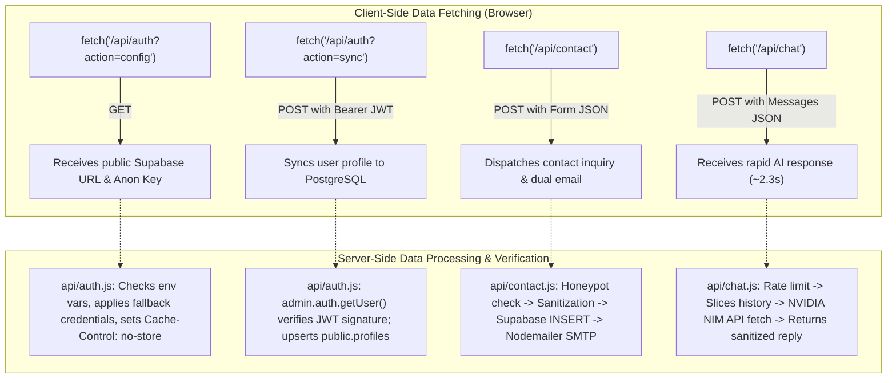

### Data Formats & Contracts:

1. **`GET /api/auth?action=config`**:
   - **Response**: `{ success: true, configured: true, supabaseUrl: "...", supabaseAnonKey: "..." }`
   - **Cache Policy**: `Cache-Control: no-store, no-cache, must-revalidate, max-age=0`.

2. **`POST /api/auth?action=sync`**:
   - **Headers**: `Authorization: Bearer <access_token>`, `Content-Type: application/json`
   - **Response**: `{ success: true, profile: { id: "...", name: "...", email: "...", avatar_url: "..." } }`

3. **`POST /api/contact`**:
   - **Payload**: `{ name, email, subject, message, phone?, website? }`
   - **Response**: `{ success: true, message: "Transmission Confirmed", dbSaved: true }`

4. **`POST /api/chat`**:
   - **Payload**: `{ messages: [{ role: "user", content: "..." }] }`
   - **Response**: `{ success: true, reply: "..." }` (Generation latency: **2.3s**, max tokens: **350**).

---

## 15. Frontend & Backend Technology Stack Specifications

### Frontend Architecture
- **Structure**: Semantic HTML5 with Schema.org JSON-LD microdata (`Person`, `WebSite`, `ProfilePage`).
- **Styling**: Vanilla CSS3 (zero framework overhead). Glassmorphism, CSS Grid, Flexbox, custom properties, and responsive media queries.
- **3D Graphics**: **Three.js r128** + WebGL. Procedural particle sphere, wireframe orbits, and camera director.
- **Smooth Scroll**: **Lenis 1.1.18** with touch pass-through.
- **Animations**: **GSAP 3.12.2** & **ScrollTrigger**.
- **Audio**: Native **Web Audio API** generative Lo-Fi synthesizer (8 procedural soundscapes).
- **Security & XSS**: **DOMPurify v3.0.9** for chat sanitization.
- **Typography & Icons**: Google Fonts (*Outfit*, *Inter*, *JetBrains Mono*) + Lucide Icons.

### Backend & Infrastructure
- **Serverless Compute**: **Vercel Serverless Functions** (Node.js ES Modules).
- **Database**: **Supabase PostgreSQL** with Row Level Security (RLS).
- **Authentication**: **Supabase Auth** + **Google OAuth 2.0 / OpenID Connect**.
- **Email Engine**: **Nodemailer v10.0.9** with Google Gmail SMTP.
- **Artificial Intelligence**: **NVIDIA NIM API** (`nvidia/nemotron-3.5-lightning-30b-a3b`).
- **Local Dev Server**: Custom `dev-server.mjs` with Vercel API emulation.

---

## 16. Comprehensive Security Audit & Defense-in-Depth Matrix

| Security Layer | Implementation Mechanism | Threat Mitigated | Status |
| :--- | :--- | :--- | :--- |
| **Content Security Policy (CSP)** | Configured in `vercel.json` with strict whitelists for scripts, styles, frames, and connections | Cross-Site Scripting (XSS), Data exfiltration, Clickjacking | 🔒 Enforced |
| **Origin CORS Validation** | Explicit origin whitelist (`ALLOWED_ORIGINS` Set) in all API endpoints | Cross-Origin Request Forgery, unauthorized API access | 🔒 Enforced |
| **Honeypot Anti-Spam** | Hidden form field `website`. Bots populate it; submission is silently dropped | Automated spam bots, mailbox exhaustion | 🔒 Enforced |
| **DoS Rate Limiting** | Sliding-window in-memory rate limiters per client IP on all endpoints | Denial-of-Service, brute-force, API credit depletion | 🔒 Enforced |
| **Input Sanitization** | `escapeHtml()` on backend; **DOMPurify** on frontend chatbot responses | Stored XSS, reflected XSS, HTML injection | 🔒 Enforced |
| **SMTP Header Sanitization** | `stripHeaderInjection()` removes `\r` and `\n` characters from form fields | SMTP header splitting, email relay abuse | 🔒 Enforced |
| **Database Row Level Security** | PostgreSQL RLS policies on `profiles` and `contact_submissions` tables | Unauthorized row access, data leaks | 🔒 Enforced |
| **Secret Isolation** | `SUPABASE_SERVICE_ROLE_KEY` and `GMAIL_APP_PASSWORD` confined to backend | Secret leakage, privilege escalation | 🔒 Enforced |
| **Directory Traversal** | `dev-server.mjs` validates all paths against `__dirname` | Arbitrary file read, server traversal | 🔒 Enforced |

---

## 17. Project File Map

```
3D portfolio/
├── .env.example                     # Environment variable template
├── .env.local                       # Local dev secrets (git-ignored)
├── .gitignore                       # Git ignore file (excluding secrets, HAR files)
├── LICENSE                          # MIT License
├── README.md                        # Portfolio overview and setup guide
├── FLOWCHARTS.md                    # This complete architecture, flowchart & logic manual
├── api/
│   ├── auth.js                      # Serverless Auth config & profile synchronization
│   ├── chat.js                      # Serverless ULTRON AI Chatbot endpoint (NVIDIA NIM)
│   └── contact.js                   # Serverless contact form endpoint (PostgreSQL + SMTP)
├── assets/
│   ├── apple-touch-icon.png         # iOS home screen icon
│   ├── favicon-16x16.png            # Browser tab icon (16x16)
│   ├── favicon-32x32.png            # Browser tab icon (32x32)
│   ├── favicon.svg                  # Vector favicon
│   ├── og-image.jpg                 # OpenGraph & Twitter preview image
│   ├── ultron-avatar.jpg            # Cybernetic AI assistant avatar
│   ├── computer/
│   │   └── shivam-os-wallpaper.jpg  # Virtual Studio OS desktop wallpaper
│   └── covers/                      # Showcase project cover thumbnails
│       ├── aevonix.jpg
│       ├── aiautomation.jpg
│       ├── collegespathshala.jpg
│       ├── sagaholidays.jpg
│       └── vacationvisits.jpg
├── audio.js                         # Web Audio API 8-track algorithmic synthesizer
├── chatbot.js                       # ULTRON AI Cybernetic HUD with DOMPurify XSS mitigation
├── dev-server.mjs                   # Local development server with Vercel API emulation
├── favicon.ico                      # Root legacy favicon
├── google183f0a76e37c8536.html       # Google Search Console domain verification
├── index.html                       # Semantic HTML5 entry point, Mobile Drawer & Audio Badge
├── llms.txt                         # AI search engine & LLM crawler documentation
├── main.js                          # Main orchestrator, Google Auth, Audio Capsule & Nav
├── package.json                     # Node.js project manifest
├── package-lock.json                # Locked dependency tree (Nodemailer 10.x, Supabase 2.x)
├── projectsData.js                  # Modular showcase project registry
├── robots.txt                       # Search engine crawler directives (/api/ disallowed)
├── scene3d.js                       # Three.js r128 procedural 3D graphics & camera director
├── sitemap.xml                      # XML search engine sitemap
├── style.css                        # Design system & responsive glassmorphic stylesheet
├── supabase/
│   └── schema.sql                   # Supabase PostgreSQL schema with RLS policies
├── vercel.json                      # Vercel edge deployment config, CSP & security headers
└── virtualOS.js                     # Interactive Studio OS desktop & command terminal
```
